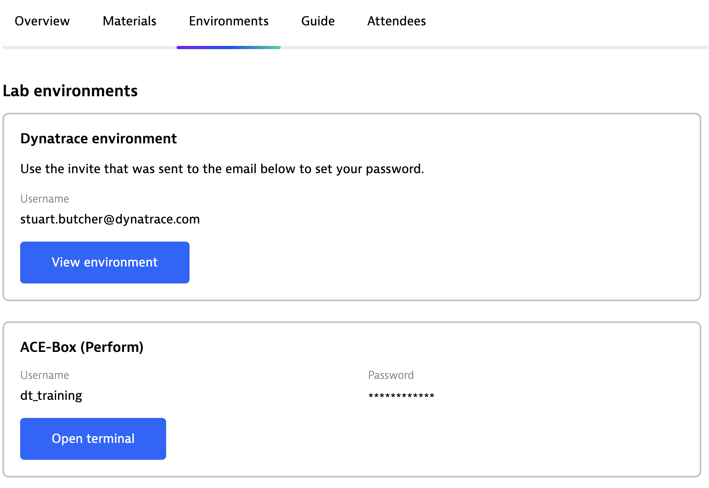
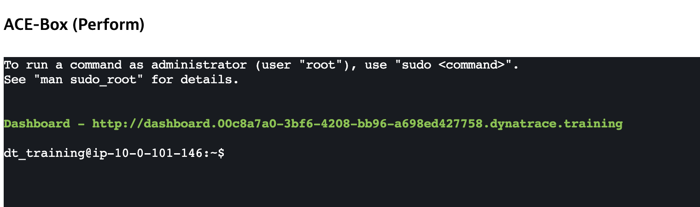
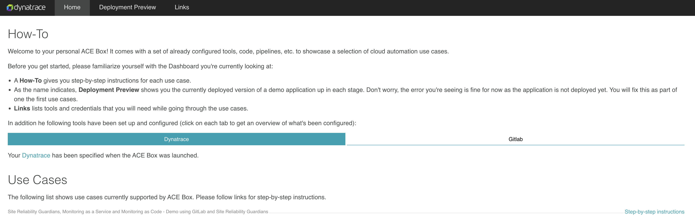
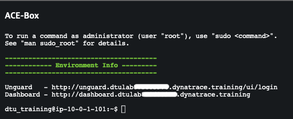
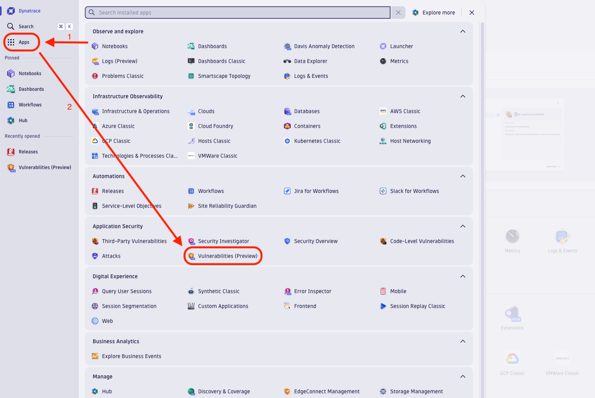
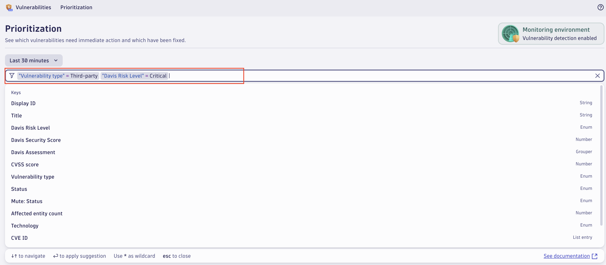
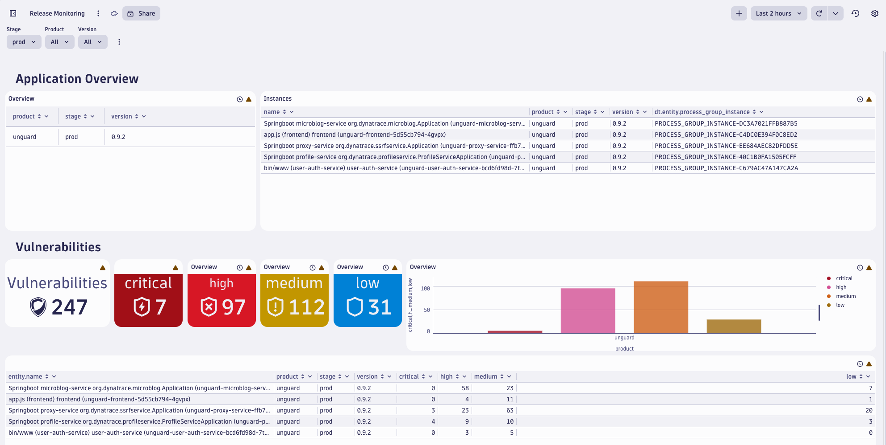

## 1 Detect, Prioritize and Visualize

## 1.1 Verify access to the environment
Before starting the exercises, let's confirm that we can access the Dynatrace user interface and lab environment.

Under the "Environments" tab Within Dynatrace University, you'll find the information on how to access the environment. Please make sure you can:
- Access the Dynatrace Environment using a web browser
- Connect to the ACE Box Terminal

## 1.2 Verify access to Dashboard
Click on `Open terminal.` This will establish a connection with the virtual machine within the lab environment and display a prompt at the bottom of the page. 

A link to the dashboard will be populated and displayed automatically. Open the link and verify that the dashboard opens successfully.

<!--To access your vulnerable application instances, you need their URLs. To get them, on your University event, open the `Environments` tab and click on `Open terminal.` This will open a terminal to the VM. 
This will give you the links to the resources used during this HOT session, as seen in the screenshot below.

For links to Unguard and WebGoat, please connect to your environment. The links will be provided on login.

 -->

## 1.3 Lab Goals

The main goals for the present hands-on exercise are:
1. Illustrate Dynatrace _Vulnerabilities_ app capabilities and how to use it
2. Learn how to prioritize vulnerability detection
3. Demonstrate how to seamlessly build reports from vulnerability detection data
4. Showcase Dynatrace _Release Monitoring_ capabilities

# 1.4 Find most critical vulnerabilities

Go to your Dynatrace Environment and navigate to the _Vulnerabilities_ app: 
- Click on Apps in the navigation on the left side
- In the `Application Security` section, click on the `Vulnerabilities` App

All detected vulnerabilities will be presented and sorted by their Davis Security Score (DSS) vulnerability score. We can use the filter field at the top to find the critical third-party vulnerabilities most at risk (exposed to the internet). The filter statement can comprise multiple fields, including but not limited to Davis risk level and Davis risk factors. 

- Using the screenshot as an aid, create a field statement that shows critical third party vulnerabilities that are exposed to the internet. 

From the remaining vulnerabilities, select the first one to see the details and look at them. Try to answer the following questions:
- Which processes are impacted by this vulnerability?
- What do you need to do to resolve it?

## 1.5 Create a report

Now let's create a report that we can show to the CISO. Navigate back to the overview (click on Prioritization). A Create report button at the top of the table allows you to generate a report (Dashboard) based on the current selection. You can either create a dashboard from scratch or use a template. There is already a template called Threat Exposure that we can use for our needs:
- Click on Create report at the top of the table
- Select the Threat exposure dashboard

This will create a dashboard based on the selected filters that can be used to share and track the evolution of the vulnerabilities.

## 1.6 Monitor applications and releases

So far, we looked at the vulnerabilities from a global perspective, but often you want to know what vulnerabilities an application has, or more precisely, a certain version of an application that is deployed. In order to get that information, we can use the [Release monitoring](https://docs.dynatrace.com/docs/shortlink/release-hub) capability in Dynatrace. 

In order to see which versions or our applications are deployed in which environments, you can take a look at the Release monitoring view. Click on Apps in the navigation and select Releases in the Automation section. 
This gives you an overview of the different versions of each application that are deployed. But in order to get more details out of it and create a overview of the vulnerabilities per application, we can leverage the dashboarding capabilities in Dynatrace.

Import the dashboard for Release Monitoring that can be downloaded from the Materials tab. 

Download the JSON file, navigate to the dashboards in Dynatrace and select *upload*. 

> [!NOTE]
> When you open a document from another user, you may see the following message:
> This dashboard contains custom code. It is read-only until you review the code and select “Accept and run”.
> If you receive this prompt, please accept and run the code. 
 
After the import, you get a new dashboard showing an overview of the different releases deployed in your environment. Using the variables at the top, you can apply filters for the stage, product or version.

- In which version is unguard deployed in prod?
- Which application is deployed in staging?

