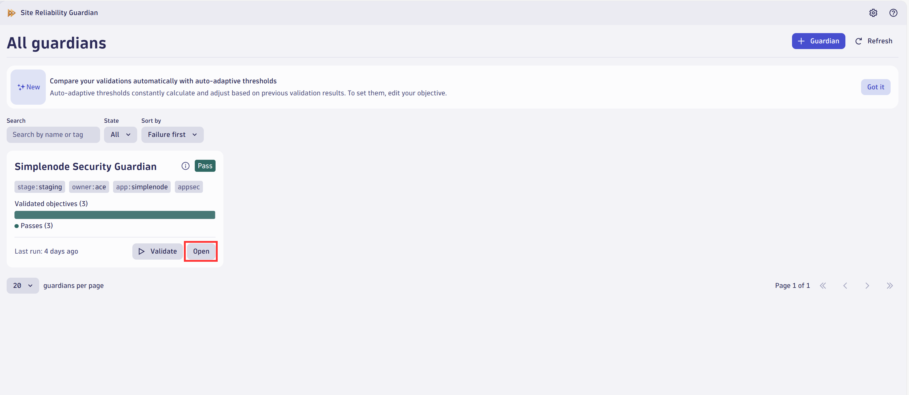
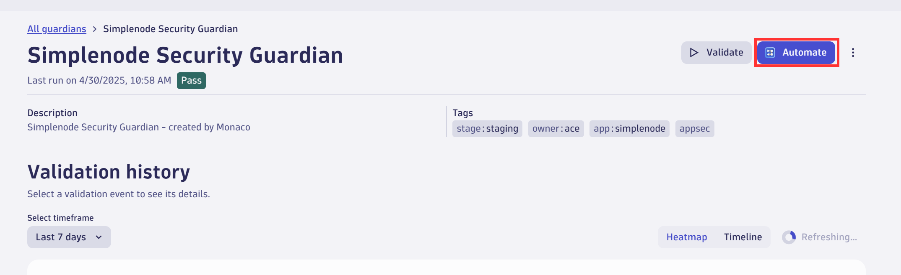
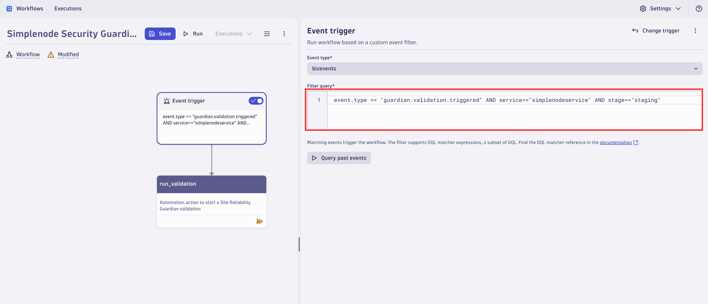
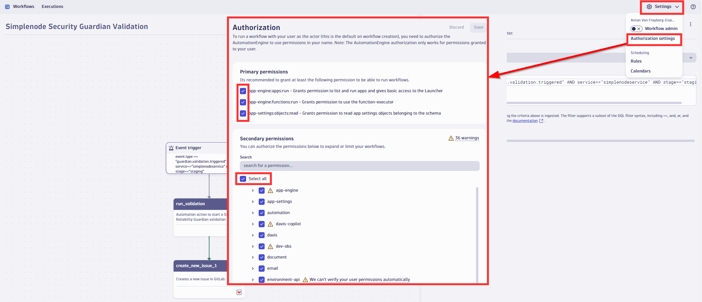
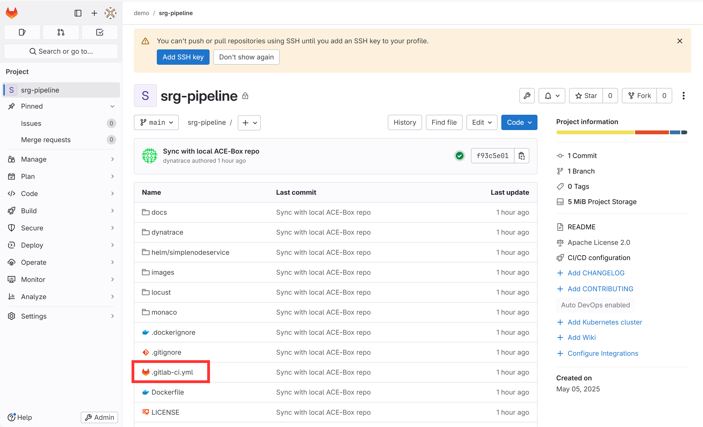
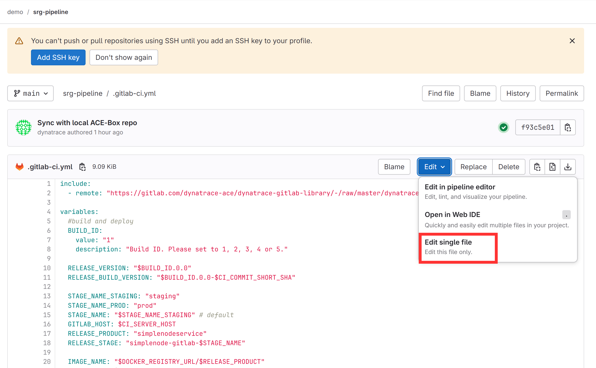
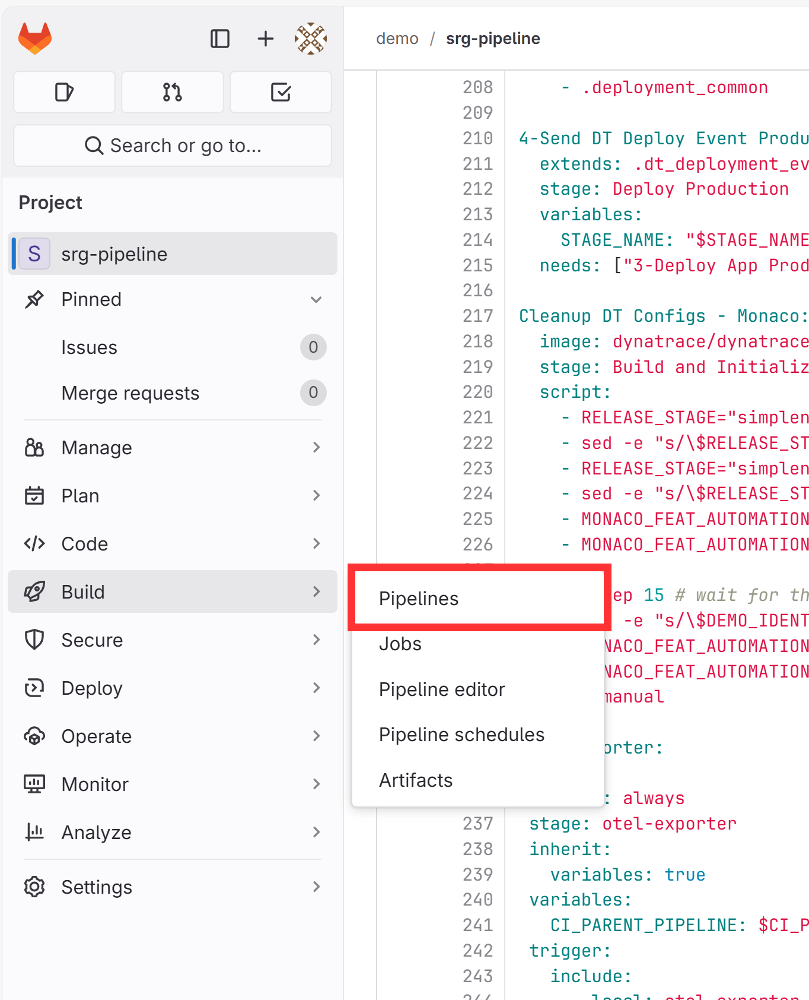

## 3 Security Gates

### Hands-on Lab: Site Reliability Guardian

In this lab we will integrate a security gate into our deployment pipeline. We will start by defining the objectives of the gate in a "guardian" in Dynatrace. In a second step we will automatically evaluate these objectives inside our Gitlab deployment pipeline. 

#### Create Workflow to automate release validation

Open the Site Reliability Guardian app and navigate to the guardian called `Simplenode Security Guardian`. This guardian evaluates different objectives. 


To automate the evaluation we can simply click on `Automate` in the guardian's overview page. 



1. We first want to change the trigger. It defines how the gitlab pipeline will trigger this automation. 

We want our trigger to be a bizevent with the following attributes:
```sql
event.type == "guardian.validation.triggered" AND service=="simplenodeservice" AND stage=="staging"
```


2. The evaluation is already configured for us.

3.  We can now use the built in gitlab action to create a gitlab issue if a new release fails to meet out quality standards.


Project: `srg-pipeline` 

Title: `Result Quality Gate on {{ result("run_validation")["guardian_name"] }} `

Labels: `srg`

Issue type: `Issue`

Description: 
```
Validation URL: {{ result("run_validation")["validation_url"]}}
Summary: {{ result("run_validation")["validation_summary"] }}
``` 
Assignee: `root`

4. As a last step, we need to make sure workflow has the right permissions. We do so by opening the authorization settings as shown in the screenshot below.



 #### Trigger the workflow from the pipeline

We now want to add add security gate to our deployment pipeline to understand if future releases of our apps introduce new vulnerabilities. In order to do so, navigate back to gitlab and open the `gitlab-ci.yaml` file in the root folder of the `srg-pipeline` repository. 





On line 7 change the default value to 5. 
```yaml
value: "5"
```
This will ensure that when you save the yaml file, a new version of the application. 


On line 178, you can add the following block. All it does is sending an event to Dynatrace that will trigger the evaluation. It passes along the start and end time of test so we evaluate that period. 

 ```yaml
Validate Release with SRG:
  image: dynatraceace/dt-automation-cli:$DTA_IMAGE_VERSION
  stage: Validate Release
  variables:
    DYNATRACE_URL_GEN3: $DT_PLATFORM_TENANT_URL
    ACCOUNT_URN: $DT_OAUTH_ACCOUNT_URN
    DYNATRACE_CLIENT_ID: $DT_OAUTH_CLIENT_ID
    DYNATRACE_SECRET: $DT_OAUTH_CLIENT_SECRET
    DYNATRACE_SSO_URL: $DT_OAUTH_SSO_ENDPOINT
    SRG_EVALUATION_STOP_ON_FAILURE: "false"
  script:
    - echo "BUILD_ID $BUILD_ID is being evaluated via Site Reliability Guardian"
    - eval_start=$(cat srg.test.starttime)
    - eval_end=$(cat srg.test.endtime)
    - export LOG_LEVEL=verbose
    - dta srg evaluate --service $SRG_EVALUATION_SERVICE --stage $SRG_EVALUATION_STAGE --start-time=$eval_start --end-time=$eval_end --stop-on-failure
 ```



