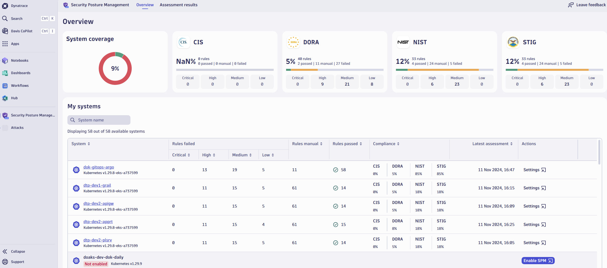
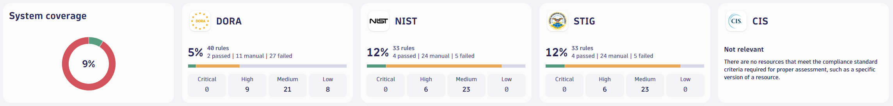
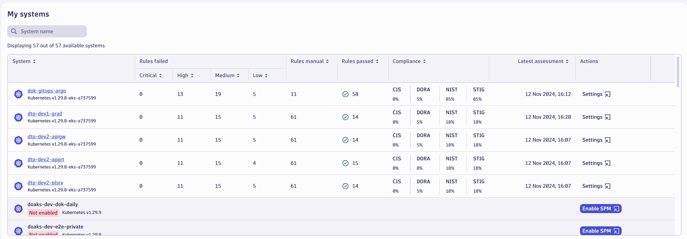
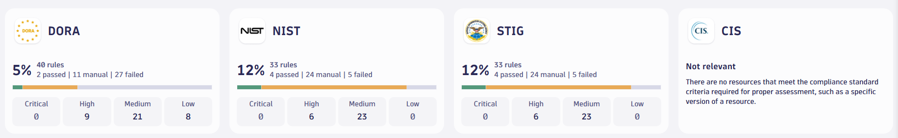
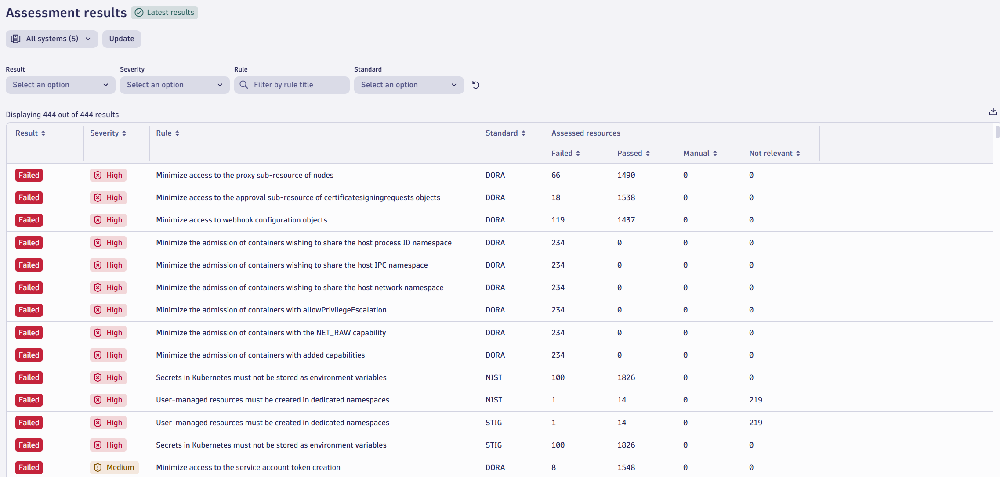
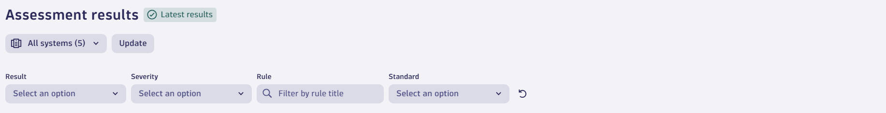
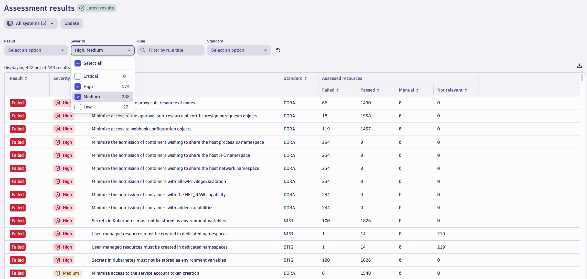
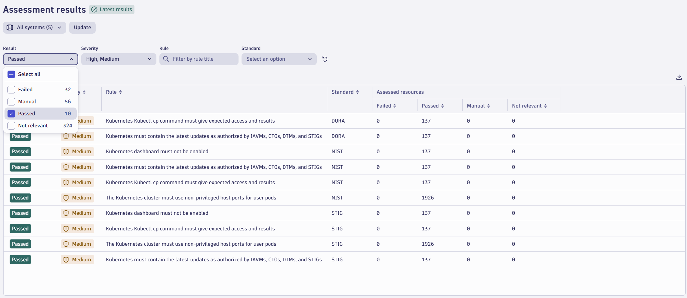
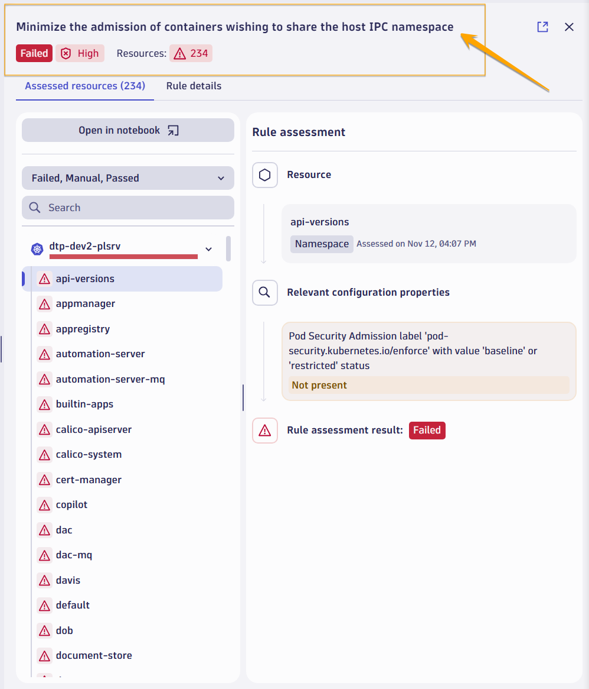
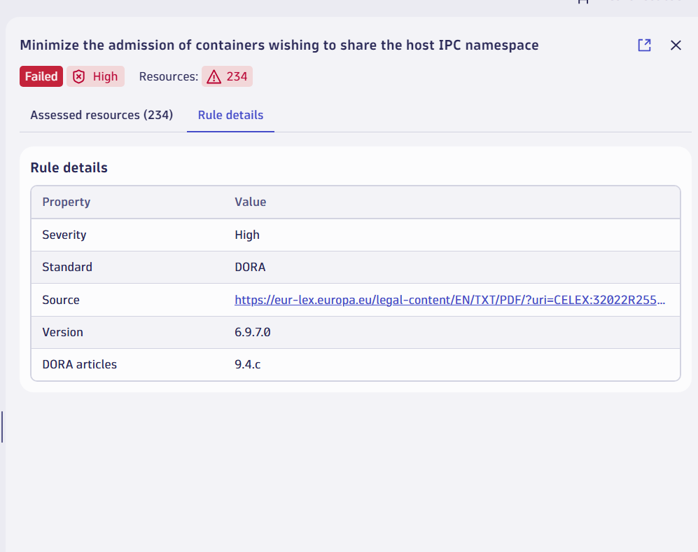

## 4 Kubernetes Security Posture Management (Instructor demo)

## 4.1 Open the Security Posture Management App 

  

 

## 4.2 Navigate to the "Overview" Tab
- **Overview Screen**: Provides easy-to-understand main tiles representing each compliance standard.

- **Compliance Standards Tiles**: Offer an instant overview of the current status.

  

 

- **My Systems Tile**: Displays an overview of where Security Posture Management is enabled, showing status per cluster.

  

 

## 4.3. Explore Compliance Standards Tiles

  

- **Drill-down Functionality**: Click on a tile to access deeper information.
- **Standards Available**:
  - CIS (Global)
  - DORA (EU Financial)
  - NIST (Non-critical GOV/Defense)
  - STIG (US DOD/GOV)

 

## 4.4 View Assessment Results for a Standard

- **Assessment Results Tab**: Displays individual rules for the selected standard.

  

 

- **Filtering Options**: Filters to customize the view.
  - Filter by status (e.g., “Failed”). 

    

  - Filter by severity (e.g., “High”) to help prioritize resources. 

    

 

- **Compliance Reporting**: Passed rules are also documented, which is essential for compliance reporting. 

  

 

### 4.5 Review Rule Details

  

 

- **Rule Details Side Panel**: Provides more detailed information.
  - Indicates exactly where the system is failing.
  - Highlights the rule assessment.

  

 

- **Access to Source and Version**: Displays the original source and version of the standard.

  

 

### 4.6 Return to the "Overview" Tab
- Reiterate that this flow applies to each compliance standard.

  

 

### 4.7 Upcoming Enhancements

- **Integration with Kubernetes Data**: Future developments will allow users to connect ECR image scanning findings to monitored SPM data.

- **Additional Standards**: Engage with users to determine which standards would be beneficial for their organizations.