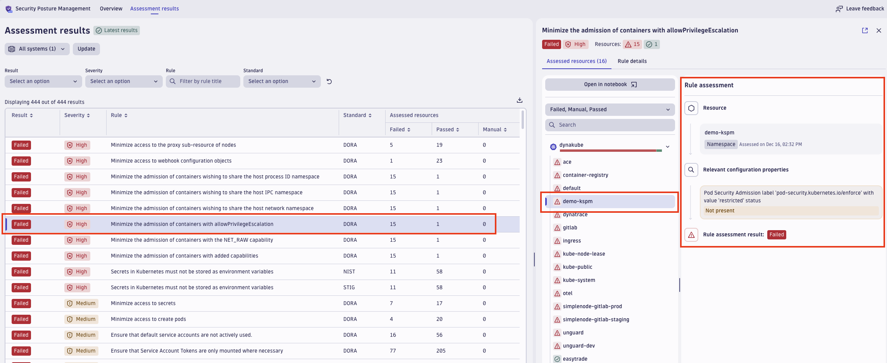
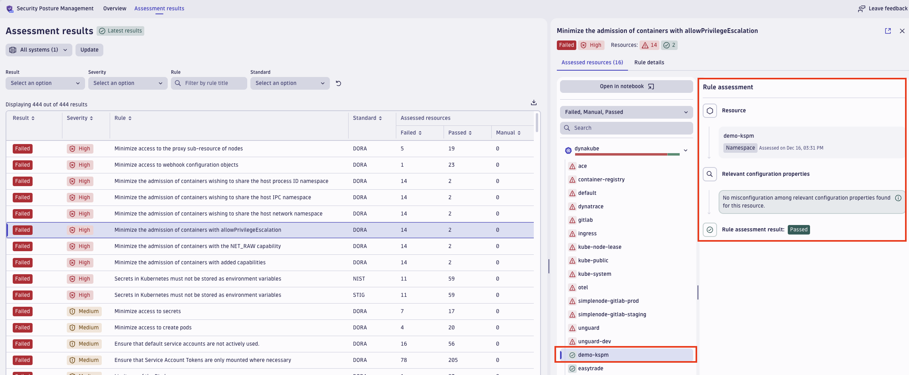

## 4 Kubernetes Security Posture Management


## 4.1.0 Introduction 


## 4.2.0 Lab Goals
The main goals of the present hands-on exercise are:
1. Demonstrate Dynatrace _Kubernetes Security Posture Management_ capabilities
2. ...


## 4.3.0 Lab Preparation
...


## 4.4.0 Hands-on
This exercise demonstrates privilege escalation risks in a Kubernetes environment and how to mitigate them using Pod Security Admission Policies.

<br>

### 4.4.1. Enable KSPM

### 4.4.2 Inspect the Kubernetes Environment
Before starting, let's take a look at the current Kubernetes environment provisioned on the VM. Ssh to the VM and run the following commands:
- List all available namespaces: `kubectl get namespaces`
- List pods across namespaces: `kubectl get pods --all-namespaces`

You’ll have a baseline understanding of namespaces and running pods in your cluster.

<br>

### 4.4.3 KSPM Assessment Results
Browse to the SPM App, switch to the `Assessment Results` section and take a look at the results:



<br>

### 4.4.4 Demonstrate Privilege Escalation Risks (Optional)
Now, let's see what the real risks that the KSPM finding is highlighting.

1. Create a dedicated namespace for this exercise: `kubectl create namespace demo-kspm`

2. Verify the namespace creation: `kubectl get namespaces`

3. Create a Privileged Pod:
  - Create a YAML file named `privileged-pod.yaml` by running `vi privileged-pod.yaml` and entering the following file (with Crtl+V):

    ```
    apiVersion: v1
    kind: Pod
    metadata:
      name: privileged-pod
      namespace: demo-kspm
    spec:
      containers:
      - name: demo-container
        image: ubuntu:latest
        command: ["sleep", "infinity"]
        securityContext:
          privileged: true
          allowPrivilegeEscalation: true
    ```

4. Apply the YAML: `kubectl apply -f privileged-pod.yaml`

5. Verify the pod is running: `kubectl get pods -n demo-kspm`

<br>

6. Now, let's access the Pod and verify the current privileges: `kubectl exec -it privileged-pod -n demo-kspm -- bash`

7. Verify the current user: `whoami`
    >Expected output: `root`

  
8. As next step, we'll demostrate that a privileged pod can break-out of its container and directly access the host filesystem::

    - Install tools to inspect and mount the host filesystem: `apt update && apt install -y util-linux fdisk mount`

    - Create a mount point: `mkdir /mnt/host`

    - Identify the disk partition containing the host's root filesystem by running: `fdisk -l /dev/sda`
    
    - Mount the host root filesystem: `mount /dev/sda1 /mnt/host`. You should now see the full root filesystem of the host.
  
9. At this point we can:
    - Read sensitive host files:
      - `cat /mnt/host/etc/passwd`
      - `cat /mnt/host/etc/shadow`

    - Write to the host filesystem: `touch /mnt/host/root/pwned-by-pod.txt`

10. Now, let's exit the pod by running `exit` and check the file `pwned-by-pod.txt` is present on the host filesystem: `sudo ls /root`

<br>

### 4.4.5: Fix the Issue
In order to fix the misconfiguration and avoid such risky scenarios to take place, we'll ...

1. Check current labels for namespace: `kubectl get namespace demo-kspm --show-labels`

2. Label the `demo-kspm` namespace to enforce the restricted policy: `kubectl label namespace demo-kspm pod-security.kubernetes.io/enforce=restricted --overwrite`

3. Create a new YAML file named `other-privileged-pod.yaml`:

    ```
    apiVersion: v1
    kind: Pod
    metadata:
      name: other-privileged-pod
      namespace: demo-kspm
    spec:
      containers:
      - name: demo-container
        image: ubuntu:latest
        command: ["sleep", "infinity"]
        securityContext:
          privileged: true
          allowPrivilegeEscalation: true
    ```

  Verify the policy by attempting to create a new privileged pod in the namespace: `kubectl apply -f other-privileged-pod.yaml`

    > Expected output:
        Error from server (Forbidden): pod "privileged-pod" is forbidden: violates PodSecurity "restricted:latest"
        The Kubernetes API will reject the pod creation because it violates the restricted PodSecurity policy.

4. Now let's finish by checking that it still possible to deploy a compliant pod:
    Create a `unprivileged-pod.yaml`:

    ```
    apiVersion: v1
    kind: Pod
    metadata:
      name: unprivileged-pod
      namespace: demo-kspm
    spec:
      containers:
      - name: demo-container
        image: ubuntu:latest
        command: ["sleep", "infinity"]
        securityContext:
          privileged: false
          allowPrivilegeEscalation: false
    ```

    **Explanation of Changes**:
      - `privileged: false`, ensures the pod is not running in privileged mode.
      - `allowPrivilegeEscalation: false`, prevents processes in the container from gaining additional privileges.

<br>

5. Apply the compliant configuration: `kubectl apply -f unprivileged-pod.yaml`

6. Verify the compliant pod is running: `kubectl get pods -n demo-kspm`

<br>

### 4.4.6 KSPM Finding Gets Resolved
Let's go back on the SPM App on Dynatrace console and we can see that the finding is fixed on the `demo-kspm` namespace as soon as the new assessment takes place:




<br>

## 4.5.0 Summary
This demonstration illustrates how Kubernetes security policies can block privilege escalation risks and enforce compliance with security best practices.
