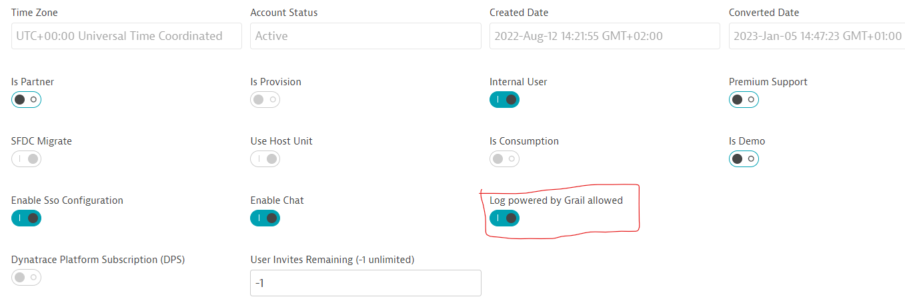

# demo-release-validation-srg-gitlab

## Prerequisites

 - Make sure that "Log Powered by Grail" is allowed for your account on the BAS admin page as shown in the screenshot below. If not, please contact your Dynatrace account admin.
   
   

 - Upgrade to new log Storage configuration from the "Settings -> Log Monitoring -> Log sources and storage" menu in Dynatrace. 

## Version and compatibility

   | Entity | Version verified  |
   | --- | --- |
   | Site reliability guardian schema | 1.0.2 |

- This demo is verified with the above Site Reliability Guardian Schema version. If you are using an older version, please upgrade to the latest version. You can check the schema version in the schema info page as shown in the screenshot below.
   
   
   
## Required extra vars

|Variable name|Description|
|---|---|
|dt_environment_url_gen3|Dynatrace Gen3 environment url, e.g. `https://<YOUR ENVIRONMENT ID>.sprint.apps.dynatracelabs.com`|
|dt_oauth_sso_endpoint|Dynatrace OAuth endpoint, e.g. `https://sso-sprint.dynatracelabs.com/sso/oauth2/token`|
|dt_oauth_client_id|Dynatrace OAuth client id. Make sure the following scopes are assigned to your OAuth client: <ul><li>storage:logs:read</li><li>storage:bizevents:read</li><li>storage:events:read</li><li>storage:events:write</li><li>storage:buckets:read</li><li>automation:workflows:read</li><li>automation:workflows:write</li><li>app-engine:apps:run</li><li>settings:objects:read</li><li>settings:objects:write</li><li>settings:schemas:read</li></ul>Make sure your Workflow authorization settings reflect the same scopes.|
|dt_oauth_client_secret|Dynatrace OAuth client secret|
|dt_oauth_account_urn|Dynatrace OAuth account URN|

Extra vars can be set e.g. as Terraform variables:

```
extra_vars = {
  dt_environment_url_gen3 = "https://<YOUR ENVIRONMENT ID>.sprint.apps.dynatracelabs.com"
  dt_oauth_sso_endpoint   = "https://sso-sprint.dynatracelabs.com/sso/oauth2/token"
  ...
}
```

### Use Case Documentation

Check out [Use case documentation](files/docs/README.md) for more details.
