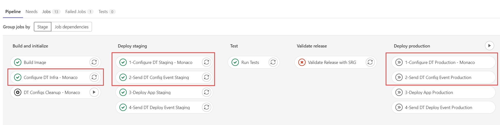
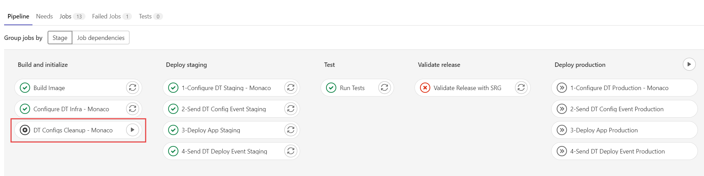

# 6. Dynatrace Configurations leveraging Monaco 2.0

We perform Dynatrace configurations automatically via `Monaco`. Thus, all the infrastructure related configurations are applied before the next stages. Application-related Dynatrace configurations are applied before the application deployments on their respective environments (staging and production). 

- infrastructure (job: `Configure DT Infra - Monaco` under stage: `Build and Initialize`): More generic settings that can be applied   to both Dynatrace staging and production environments
  - private synthetic location (ACE-Box)
  - request attributes (LTN,LSN,TSN)
  - Auto-tags (auto-tag-env, auto-tag-app)
- app: Application specific settings
  - staging (job: `1-Configure DT Staging - Monaco` under stage: `Deploy Staging`): Corresponding to the application release on staging environment
  - production (job: `1-Configure DT Production - Monaco` under stage: `Deploy Production`) : Corresponding to the application release on production environment
  common settings for staging and production releases:
    - Ownership
    - Auto-tag
    - Application Detection
    - Application
    - Synthetic Monitor
    - Calculated Metrics Service
    - SLO 
    - Dashboard
- SRG and Workflow definitions (job: `1-Configure DT Staging - Monaco` under stage: `Deploy Staging`):
  - Workflow
  - SRG to utilize SLO definitions for defining validation objectives
- Sending events to notify Dynatrace about the configurations done via Monaco (job: `2-Send DT Config Event Staging` under stage: `Deploy Staging`  and job: `2-Send DT Config Event Production` under stage: `Deploy Production` )

## Cleanup
  To remove the configurations applied to Dynatrace for this demo activity, you can trigger the manual task from the Gitlab pipeline. 
  
  

## Continue to the Pipeline Stages
- [5. Deployment Stage](../Deployment/README.md) to have the detailed explanation of Simplenode application deployments with the respective build options.