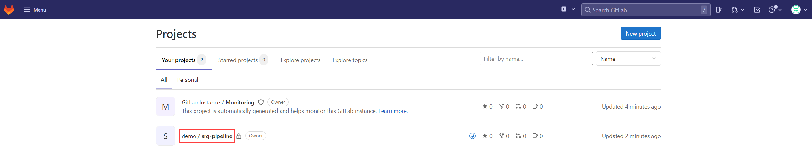
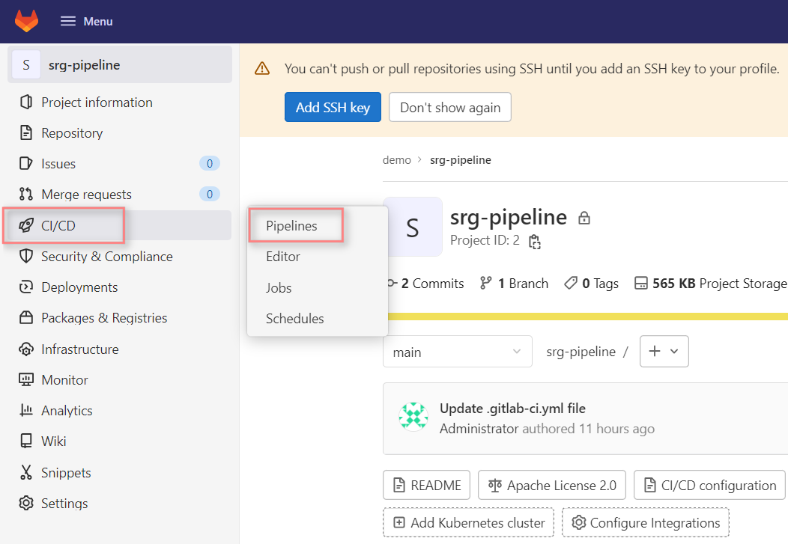
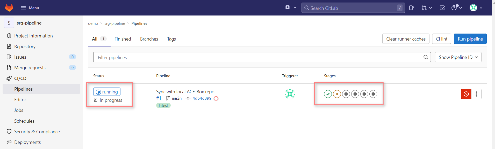

# Demo use case: Release Validation with Site Reliability Guardian
This document outlines how to demo a release validation use case leveraging Dynatrace Site Reliability Guardian (SRG) using the ACE-BOX with **GitLab**.

## Demo overview
As part of this demo, we will use a set of multi-staged pipelines that have been pre-deployed within GitLab. In one of the stages, we will deploy a *simplenodeservice* application based on a healthy image (*build 1*) to a *staging* environment. This version of the application passes the validation objectives defined in a Site Reliability Guardian and is promoted to the *production* environment. 

To demonstrate a fail case, we will deploy a faulty image (*build 2*) that shows a decrease in response time and an increase in request failures compared to the healthy version. These performance degradations will be caught by SRG release validation objectives during the evaluation stage to prevent this release from being promoted to the production environment.

## Demo setup
A dashboard has been deployed and is available at `http(s)://dashboard.<ingress domain>` . Basic auth credentials were provided at the end of the provisioning process. The dashboard is where you can find all relevant links and credentials.

All code and docs have been made available in the *demo* organization on *Gitlab* ( `http(s)://gitlab.<ingress domain>/demo` ):

- *srg-pipeline* project contains all application source code, Gitlab pipelines and Monaco resources. 
- *docs* folder under *srg-pipeline* project contains step-by-step instructions for the use case.

>Note: the name of the organization might be different depending on the deployment of the ace-box.

*Gitlab* is our CI/CD tool of choice and is available at `http(s)://gitlab.<ingress domain>`. Pipeline configuration that we use as part of this use case can be found in repo *srg-pipeline*.

*Dynatrace* will monitor our demo application and is the source of truth for deployment and configuration change events. In addition, Dynatrace's AutomationEngine workflows, site reliability guardians provide all capabilities needed for release validation.

All demo applications as well as tools are deployed on *Kubernetes* (*Microk8s*). An NGINX ingress is used to expose services.

## Demo pipeline
1. Navigate to your GitLab instance. The link and credentials can be found on the ACE dashboard.
   
     
2.  Within the GitLab UI, select the `demo/srg-pipeline` project
3. Click on the `CI/CD` link in the left menu bar
   
    
4. You will see that the initial pipeline automatically started. Depending on how long it has been since the ACE-BOX was provisioned, it might have already finished
 
    

## Source Code
All the pipelines and source code are stored in the ace-box's GitLab Repository server. The link and credentials can be found on the ACE dashboard. If you go back to the project's home, or select `Repository` in the left menu bar, you will have access to the source code

The following noteable files/folders exist:
- `helm/simplenodeservice` folder: contains the helm chart for the simplenodeservice
- `locust` folder: contains the test files
- `monaco` folder: contains the monaco configuration
- `app.js`: simplenodeservice application code
- `Dockerfile`: simplenodeservice Dockerfile definition for building the container image
- `.gitlab-ci.yml`: The GitLab pipeline definition

## Starting the demo
As mentioned above, the first pipeline automatically triggers when GitLab gets deployed on the ACE-BOX. Follow the links below to get more details on what happens and how to perform the demo.

1. Release Validation
   - [Successful Build](Release_Validation/03_01_Successful_Build.md)
   - [Failed Build](Release_Validation/03_02_Failed_Build.md)
   - [Evaluation Explained](Release_Validation/03_03_Evaluation_Explained.md)
2. [Workflow and SRG Definitions](Workflow_SRG/README.md)
3. [SLI & SLO](SLI_SLO/README.md)
