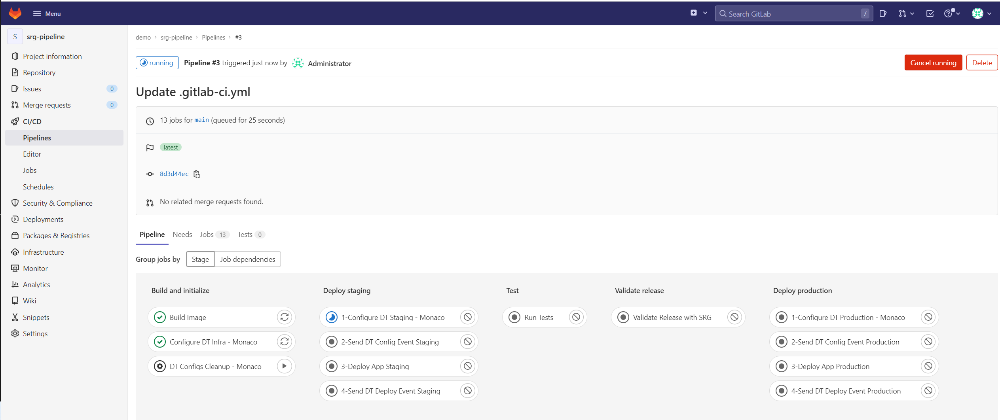
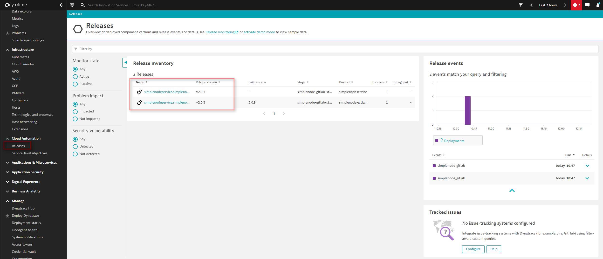
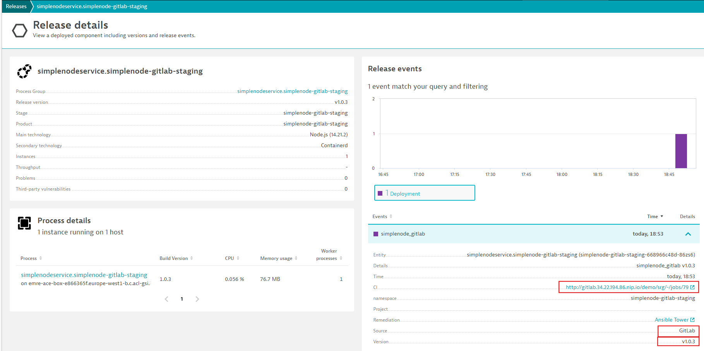

# 1. Successful Build

In this first step, we will outline the different phases of our CI configuration as well as show what happens in the background. At the end of this step, the simplenodeservice artifact will have been deployed and a release validation will have been performed with a successful result.

> Note: Build numbers might differ from what you have in your environment. When creating documentation re-runs were performed.

## Pipeline steps

1. Navigate to `CI/CD` on the left menu and click on the first build.
    The screen presented will show you the overview of the pipeline, as well as the individual stages and jobs that were part of it.

    

2. The following stages and jobs can be observed:
    1. Stage `Build and Initialize`
       1. Job `Build Image` that builds the image with a selected build ID (e.g. 1, 2, 3, 4) before running the pipeline
       2. Job `Configure DT Infra - Monaco` that applies the infrastructure-related Dynatrace configurations to both staging and production Dynatrace environments. Configurations are stored in the `monaco/infrastructure` folder within the repository.
       3. Manual Job `Cleanup DT Configs - Monaco` that cleans up the Dynatrace configurations related to this demo from Dynatrace staging and production environments via Monaco. It is recommended to run this job manually when you finish your demo session. 
    2. Stage `Deploy-staging`  
       1. Job `1-Configure DT Staging - Monaco` that configures the Dynatrace staging environment with the application and workflow related configurations that are stored in the `monaco/app` and `monaco/srg` folders within the repository. 
          A sleep is needed to give Dynatrace some time to tag host according to current config before sending the config event 
       2. Job `2-Send DT Config Event Staging` that sends events to notify that the respective configurations are applied to Dynatrace staging environment
       3. Job `3-Deploy App Staging` that deploys the simplenodeservice application using helm in the staging environment
       4. Job `4-Send DT Deploy Event Staging` that sends a Deployment Event to Dynatrace indicating the act of deployment took place in the staging environment
    3. Stage `Test` contains one job, `Run Tests` that leverages Locust to send multiple requests to the application to test the performance. The configuration of the tests can be found in the `locust` folder within the repository
    4. Stage `Validate Release` contains a job `Validate Release with SRG` which performs the Release Validation using Dynatrace Site Reliability Guardian. If this job is completed successfully, it will promote the release to the production environment. In the "fail" case, it will stop the pipeline
    5. Stage `Deploy Production`  
       1. Job `1-Configure DT Production - Monaco` that configures the Dynatrace production environment with the application related configurations that are stored in the `monaco/app` folder within the repository. 
          A sleep is needed to give Dynatrace some time to tag host according to current config before sending the config event 
       2. Job `2-Send DT Config Event Production` that sends events to notify that the respective configurations are applied to Dynatrace production environment
       3. Job `3-Deploy App Production` that deploys the simplenodeservice application using helm in the production environment
       4. Job `4-Send DT Deploy Event Production` that sends a Deployment Event to Dynatrace indicating the act of deployment took place in the production environment
   > Note: Dynatrace staging and production environments are the same for this demo activity. The best practice is to have separate Dynatrace environments for staging and production requirements. 

3. By clicking on each job within the pipeline, it is possible to observe the logs of that execution

4. The `.gitlab-ci.yml` file contains the definition of the above steps

## Execution details

Once the pipeline has run completely and usually successfully, observing the evaluation results is possible.

Let´s start within Dynatrace.

1. Navigate to the `Releases` screen   
    
    > Note: if no events are visible, you might need to select a larger time frame
2. Click on the release in the `simplenode-gitlab-staging` environment
   
    

## Next Steps
Navigate to [2. Failed Build](03_02_Failed_Build.md)
