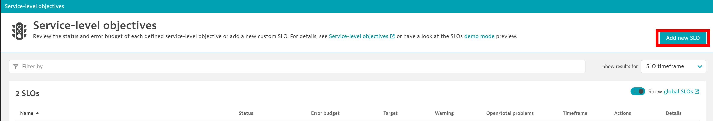

## SLIs & SLOs

Dynatrace provides all the necessary real-time information that your Site-Reliability Engineering (SRE) teams need to monitor their defined objectives.

Once the SRE team has selected a collection of indicator metrics, what remains is to define and monitor the operational goal within a service-level objective (SLO).

Let's see how these can be defined in Dynatrace!

### Create an SLO using Dynatrace UI

1. We now want to create our first SLOs by hand in Dynatrace. To do this, go to your Dynatrace tenant and navigate to `Search > Search "Service-level objectives" -> Select "Service-level objectives"`. To create a new SLO click on `Add new SLO`. This will open the SLO Wizard used to create SLOs in the UI. 



To create an SLO we need to define the following:
1. **The SLO name**
2. **The metric expression**: 
This field uses the Dynatrace native "metric selector" which is used throughout the product, in the UI and API, to declaratively select metrics (see docs [here](https://www.dynatrace.com/support/help/dynatrace-api/environment-api/metric-v2/metric-selector)).
1. **An entity filter**:
This field uses the Dynatrace native "entity selector" which is a powerful way of declaratively selecting entities throughout your Dynatrace environment. (see docs [here](https://www.dynatrace.com/support/help/dynatrace-api/environment-api/entity-v2/entity-selector)).
1. **Success criteria**:
This will be the target scores to define if the SLO is met (or not).

Now, let's define some SLOs.

#### Availability

The first SLO will be for availability, with the following values:
- SLO name: `simplenode availability`
- Metric expression: `builtin:synthetic.http.availability.location.total:splitBy():avg:auto`
- Entity filter: `type(HTTP_CHECK), entityName("webcheck.simplenode.staging")`
- Success criteria: 
    1. `Target Percentage: 99.8%`
    2. `Warning percentage: 99.9%`
    3. `Slow-burn rates between 1 and 2`
    4. `Fast-burn rates greater than 2`

### Create an SLO from a template via Monaco

   Navigate to `monaco > app > _config.yaml` to see the SLO configuration parameters.

    ```
    #slo
    - id: slo_success_rate
      type:
        api: slo
      config:
        template: slo.json
        name:
          type: compound
          format: "{{ .tag_stage }}_slo_success_rate_{{ .demoIdentifier }}"
          references:
            - tag_stage
            - demoIdentifier
        parameters:
          description: "Service Errors Total SuccessCount / Service RequestCount Total"
          metricNumerator: "builtin:service.errors.total.successCount:splitBy()"
          metricDenominator: "builtin:service.requestCount.total:splitBy()"
          filterType: "SERVICE"
          target: 95
          warning: 99
          releaseProduct:
            type: environment
            name: RELEASE_PRODUCT
          releaseStage:
            type: environment
            name: RELEASE_STAGE
          sloTimeFrame:
            type: compound
            format: "-{{ .timeFrame }}"
            references:
              - timeFrame
          timeFrame:
            type: environment
            name: TEST_TIMEFRAME
          demoIdentifier:
            type: environment
            name: DEMO_IDENTIFIER
          tag_stage:
            type: environment
            name: SRG_EVALUATION_STAGE
        skip: false
    ```
### Use the SLOs for SRG Objectives

    ```
    objective_name_slo_success_rate: "Success Rate"
    reference_slo_success_rate: ["app","slo", "slo_success_rate", "name"]
    reference_slo_metric_success_rate:
        type: compound
        format: "func:slo.{{ .reference_slo_success_rate }}"
        references:
        - reference_slo_success_rate
    failure_slo_success_rate: 98
    warning_slo_success_rate: 99
    
    objective_name_slo_availability: "Availability of Service"
    reference_slo_availability: ["app","slo", "slo_availability", "name"]
    reference_slo_metric_availability:
        type: compound
        format: "func:slo.{{ .reference_slo_availability }}"
        references:
        - reference_slo_availability
    failure_slo_availability: 98
    warning_slo_availability: 99
    ```

## Site Reliability Guardian Details
- [Site Reliability Guardian](../Workflow_SRG/README.md#2-create-a-new-guardian) to embed the SLO definitions as an objective into a Site Reliability Guardian

