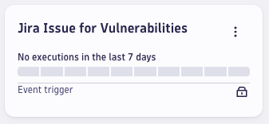
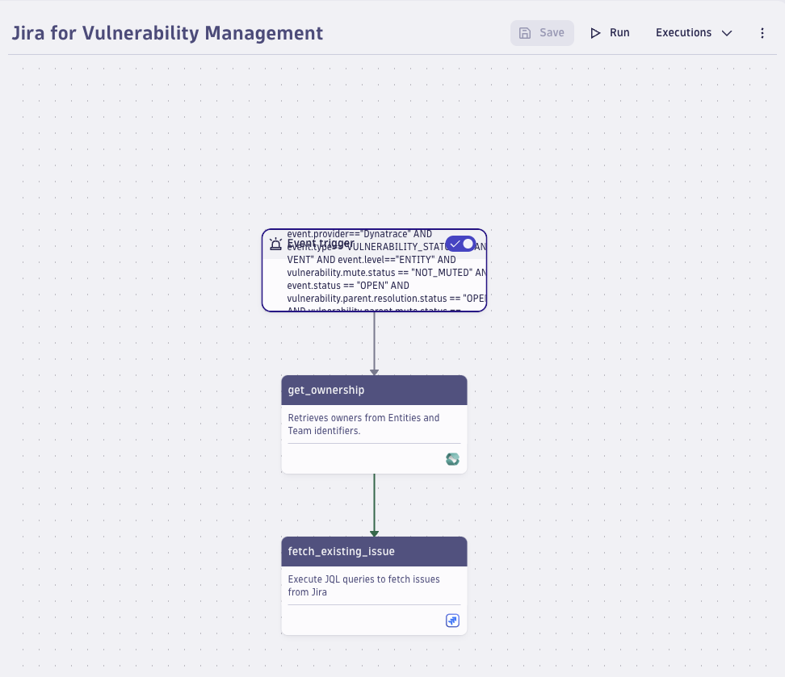
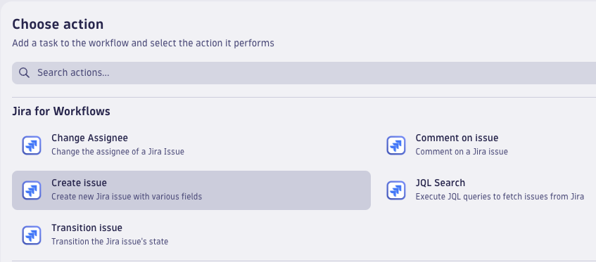
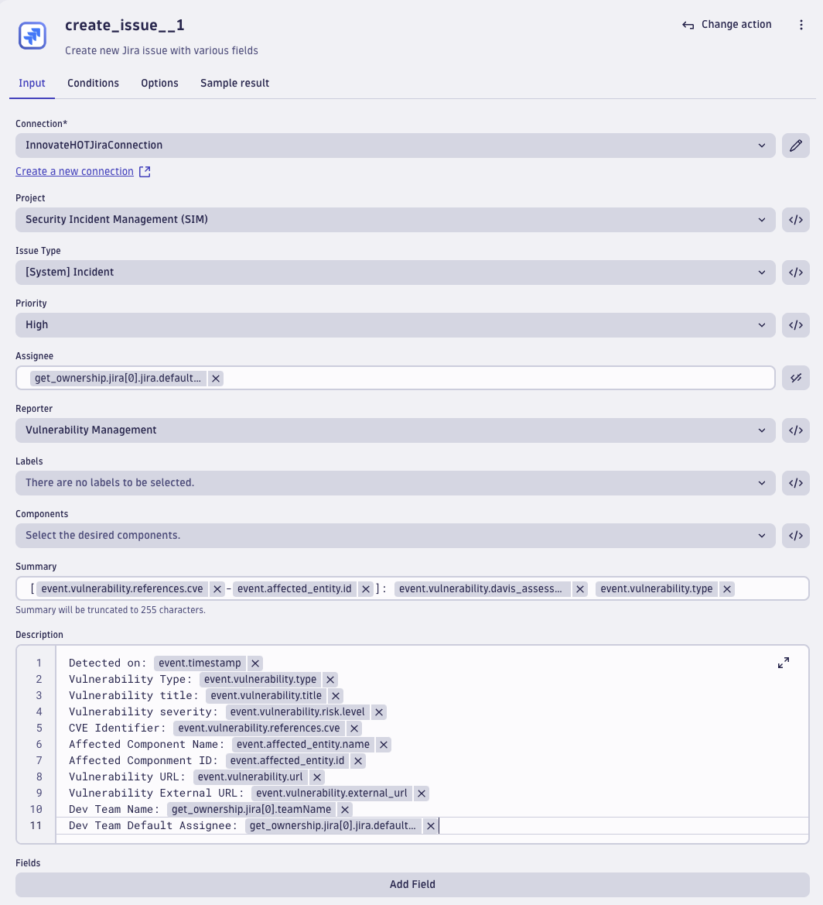
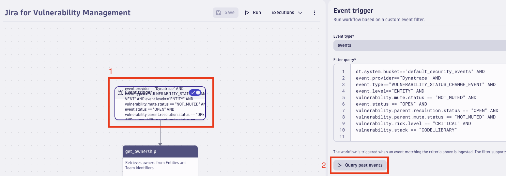
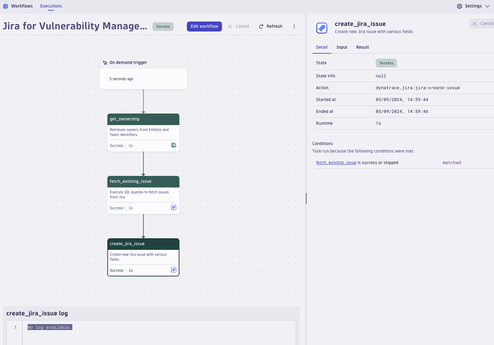

## 2 Enhance and Automate Vulnerability Management


## 2.1.0 Introduction to Vulnerability Management
In today's rapidly evolving cybersecurity landscape, effective vulnerability management is crucial for maintaining the security and integrity of any organization's IT infrastructure. 

Vulnerability management is the process of identifying, evaluating, treating, and reporting on security vulnerabilities in systems and the software that runs on them. Incident management, on the other hand, involves detecting, responding to, and recovering from security incidents that may occur.

As the complexity of IT environments increases, so does the need for automated tools that can streamline and enhance these processes. Automation in security operations can significantly reduce the time required to identify and respond to potential threats, ultimately reducing the risk of breaches and ensuring compliance with security standards.

Dynatrace platform is an all-in-one solution that provides comprehensive monitoring and vulnerability management capabilities. By leveraging the automation features within Dynatrace, organizations can efficiently detect vulnerabilities in real-time, prioritize them based on risk, and initiate automated workflows to manage incidents. Integrating Dynatrace with Jira, a leading issue and project tracking tool, further enhances the operationalization of security by enabling teams to track and manage security incidents from detection to resolution in a seamless and structured manner.
This lab guide will walk you through the steps to enhance your vulnerability management and incident management processes using Dynatrace’s automated workflows and integrating them with Jira for effective tracking and management.


## 2.2.0 Lab Goals
By the end of this lab, you will be able to:
1. Understand how to configure and use Dynatrace for automated vulnerability management
2. Set up automated workflows in Dynatrace to operationalize Security events
3. Integrate Dynatrace with Jira to track and manage Security incidents efficiently


## 2.3.0 Hands-on: Jira Issue Creation

Browse to the Dynatrace Workflow section and open the "_Jira Issue for Vulnerabilities_" workflow.



The workflow is performing the following:
 - Detect newly detected vulnerability on the monitored applications
 - Retrieve the ownership information and contacts of the impacted entities and components
 - Querying Jira to check if there already exists a Jira Issue for the specific vulnerability and Entity


### 2.3.1 Workflow Details

The workflow is composed of three blocks:
- <b>Event_Trigger</b>: Event-based trigger that fetches _VULNERABILITY_STATUS_CHANGE_EVENT_ and looks for events with status equal to `NEW_OPEN`
- <b>Get_Ownership</b>: it retrieves the affected entity responsible team contact details for Jira
- <b>Fetch_existing_issues</b>: it performs a JQL query looking within the "_InnovateHOTLabs_" Jira instance and within the specific project which is dedicated for managing security incidents ("_Security Incident Management_") for issues objects in with a specific Identifier in the Summary. The identifier is the concatenation of a specific CVE code and the _Entity_Id_ related to the entity where the vulnerability has been detected.




## 2.3.2 Jira Issue Creation Task
In this exercise, the goal is to create a task to automatically create a Jira issue with all the relevant information for the vulnerability incident management process to manage the situation. In addition, ensure the Jira Issue creation task is executed only in case no issues are found by the previous "_fetch\_existing\_issue_" action.

<br>
<details>
<summary>Click to see the solution</summary>

- *Step-1*: add a new action, by clicking on the `[+]` symbol just below the "_fetch_existing_issue_" block:

  


- *Step-2*: Scroll down to the "_Jira for Workflows_" section and click on "_Create Issue_":

  

   Within the _Create Issue_ form, do the following:
	- Select the Jira connection called "_InnovateHOTJiraConnection_"
	- Select "_Security Incident Management_" project
	- Select "_\[System\] Incident_" Issue type
	- Select "_High_" priority
	- As regards the Assignee field, click on the `</>` button on the right and paste the following string:
  ```
  {{ result("get_ownership")["jira"][0].jira.defaultAssignee }}
  ```
 	- Select "_Vulnerability Management_" user as Reporter
	- Paste the following string as "_Summary_":
  ```
  [{{ event()['vulnerability.references.cve']|first }}-{{ event()['affected_entity.id'] }}]: {{ event()['vulnerability.davis_assessment.level'] }} {{ event()['vulnerability.type'] }}
  ```
	- Paste the following string as "_Description_":
  ```
  Detected on: {{ event()['timestamp'] }}
  Vulnerability Type: {{ event()['vulnerability.type'] }}
  Vulnerability title: {{ event()['vulnerability.title'] }}
  Vulnerability severity: {{ event()['vulnerability.risk.level'] }}
  CVE Identifier: {{ event()['vulnerability.references.cve']|first }}
  Affected Component Name: {{ event()['affected_entity.name'] }}
  Affected Componment ID: {{ event()['affected_entity.id'] }}
  Vulnerability URL: {{ event()["vulnerability.url"] }}
  Vulnerability External URL: {{ event()["vulnerability.external_url"] }}
  Dev Team Name: {{ result("get_ownership")["jira"][0].teamName }}
  Dev Team Default Assignee: {{ result("get_ownership")["jira"][0].jira.defaultAssignee }}
  ```

  The result should look like the following:

  

- *Step-3*: switch to the "_Conditions_" tab:

  

  Paste the following string as "_custom condition_" in order to execute the _Issue creation_ task only if the _Fetch_existing_issues_ task returned no results:
  ```
   {{ result("fetch_existing_issue")|length == 0 }}
  ```
 
  The result should look like the following:

  
  
- *Step-4*: Click the "_Save_" button on the top of the page:

  

</details>
<br><br>

## 2.4.0 Trigger the Workflow

The workflow is supposed to be automatically triggered in response to an event detection, however, it is also possible to run it manually to avoid waiting for an event to be raised. 
To do so, click on the event trigger box and then click on `Query past events`:



As next step, click on the `Run` button at the top of the page and on `Run` again in the popup window:


In the new window you can follow the workflow execution and inspect all the relevant details for each task:



## 2.5.0 See results on Jira

Log in into the Jira instance we have created for you by browsing this link [Innovate HOT Labs Jira](https://innovatehotlabs.atlassian.net/jira/your-work), and login with the following credentials:
```
username: InnovateHOTLabs@outlook.com
password: 2nfnNL43!lfws$
```

Then navigate to the "_Security Incident Management_" project board and spot the issue you created!
