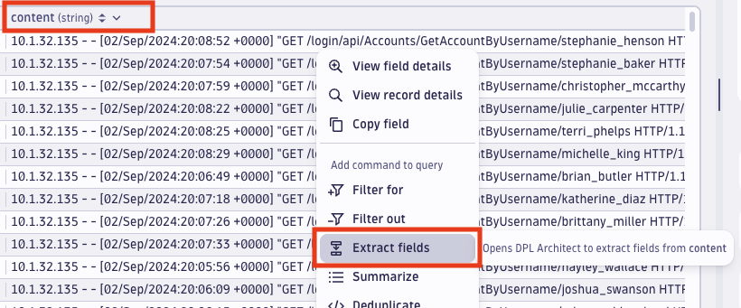
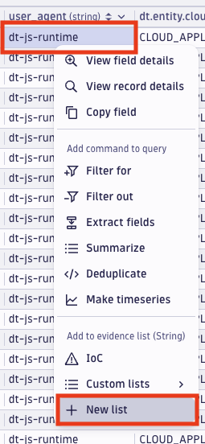
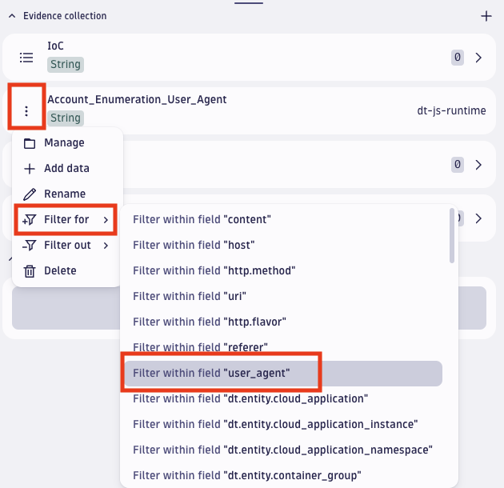

## 4 Security Investigation


## 4.1.0 Introduction 
A malicious actor has targeted a web application (EasyTrade) with the intention of identifying valid usernames using an _account enumeration_ technique, which is a type of security exploit where an attacker attempts to discover valid usernames on a web application or service by analyzing the responses to login attempts or other user-related requests.

Imagine that the attacker has discovered that by making HTTP requests to a specific application endpoint, it is possible to infer the existence of user accounts based on the HTTP response status codes. When a valid username is provided in the request, the server responds with a `200 OK` HTTP status code, indicating that the account exists. When an invalid username is provided, the server responds with a `404 Not Found` HTTP status code.
The malicious actor uses this application vulnerability to test a series of potential usernames, aiming to identify which ones are valid accounts on the application.


## 4.2.0 Lab Goals
The main goals of the present hands-on exercise are:
1. Demonstrate Dynatrace _Security Investigator_ capabilities
2. Analyze Security incidents effectively
3. Enhance Security monitoring skills through application log inspection


## 4.3.0 Lab Preparation
First thing, go to the Dynatrace University Event page, click on _Environments_ and then on _Open Terminal_:


Then, copy the EasyTrade Endpoint appearing in the terminal. It should look similar to the following:

```
easytrade.dtulab123123123.dynatrace.training
```

<br><br>
Then, go to the Dynatrace environment, browse to the Dynatrace Workflow section and open the "_Hands-on 4: Account Enumeration Simulation_" workflow.


This is a simple workflow which is executing a javascript code to simulate a malicious account enumeration activity against the _EasyTrade_ web application. More specifically, it has a dictionary containing a set of popular account usernames and it tries to verify the presence of such usernames within _EasyTrade_ application user-base through API calls:


After that, click on the _execute\_account\_enumeration_ Javascript task:


Then, in the new window on the right-side of the screen, you need to substitute the `<your-domain>` placeholder with the EasyTrade domain that you have copied previusly from the terminal.


Then, click the `Run` button on the top of the page and wait for the execution to be completed:


## 4.4.0 Hands-on: Security Investigation
In this exercise, the goal is to identify which is the account that the has been successfully enumerated by inspecting the application logs leveraging on the _Security Investigator_ app capabilities.

> Hint: you can find _EasyTrade_ logs querying the _"logs"_ bucket in Grail, and you can find them filtering for `k8s.namespace.name == "easytrade"`

<br>
<details>
<summary>Click to see the solution</summary>

- <b>Step-1</b>: browse to the the _Security Investigator_ app:
  
  

  To create a new investigation case, click on the `[+ Case]` button on the right-hand side of the screen:

  
  

- <b>Step-2</b>: filter the _EasyTrade_ logs by replacing the built-in query with the following and hit the run button:
  ```
  fetch logs
  | filter k8s.namespace.name == "easytrade"   
  ```

- <b>Step-3</b>: take a look at the results. Since we are looking for traces in the logs related to an account enumeration attempt, we need to find some logs that are reporting some kind of account details retrieval activities. Can you spot them?

  To do so, add the following filter to the query and run it again:
  ```
  | filter contains(content, "GET /login/api/Accounts/GetAccountByUsername/")
  ```
  
- <b>Step-4</b>: now that you have filtered out all the logs related to account information retrieval activities, you can parse the _content_ field and extract the most relevant information leveraging on the power of DQL.

  To do so, right-click on the `content` value and select `Extract fields`.
  
  
  
  Within the new popup window, click on `Saved patterns` at the top left corner, then select `apache` and then `access` in the dropdown menu:
  
  
  
  A default pattern extraction query is automatically added, and it should look like the following:
  ```
  (IPADDR:'http.client_ip' | [! \n]+):host
  ' ' ('-' | NSPACE:ident)
  ' ' ('-' | (DATA{1,8096}:auth >>(' [' HTTPDATE)))
  ' ' '[' HTTPDATE:event_time ']'
  ' ' (('\"' [A-Z-_]+:'http.method' ' ' LD{0,8096}:uri ' ' LD{3,10}:'http.flavor' '\"') | DQS:invalid_request)
  ' ' LONG:'http.status_code'
  ' ' (LONG:'http.response.content_length' | '-')
  (' ' DQS:referer (' ' DQS:user_agent)?)?
  ```
  
  Finally, click on `Insert pattern` and run the query again:

  


  As soon as the query completes, you can observe that new fields have been added right after the _content_ field: _http.client\_ip_, _http.method_, _uri_, _http.status\_code_ and _user\_agent_.


- <b>Step-5</b>: scroll right on the query results and by looking at the _user\_agent_ column, you can observe a number of consecutives attempts report `dt-js-runtime` as value. Those records are the ones related to the Account Enumeration Simulation activity that you have triggered at the beginning of the lab using the provided workflow.

  Now you are going to leverage on the _Security Investigator_ capabilities and save the UserAgent value as an `Evidence` by right-clicking on the `dt-js-runtime` value, selecting the `+ New list` option in the menu:

  


  Then, type a name for the `New Evidence` (for instance: `Account_Enumeration_User_Agent`) and finally click on the `create` button:

  


  You should now see the new `Evidence` in the right-hand side of the screen:

  


  As next step, you are going to filter out only those records that have been generated by the account enumeration simulation activity by clicking on the menu button just next to the new `Account_Enumeration_User_Agent` evidence, click on `Filter for` and then select `Filter within field "user_agent"`:
  
  

  
   As a result, you should see that the following filter has appeared in the query:
  ```
  | filter contains(user_agent, "dt-js-runtime")
  ```

  Click on the `Run` button to execute the query again and take a look at the results.

- <b>Step-6</b>: now that you have isolated all the logs related to the attack simulation, it's time to dig deeper and try to find out if the enumeration attempts have been successful or not.

  To do so, again you can leverage on the power of the _Security Investigator_ and DQL by clicking on the `http.status_code` column header and selecting `Summarize`:
  
  
  
   As a result, you should see that the following command has been automatically added to the query:
  ```
  | summarize count = count(), by: {http.status_code}
  ```
  
  What you need to do next, is to add the `uri` as additional field in the summary action. To do so, just add a comma after the `http.status_code` field and type `uri`. The result should look like the following:
  ```
  | summarize count = count(), by: {http.status_code, uri}
  ```
  
  Then, run the query again.


- <b>Step-7</b>: Take a look at the query results.

  How many user accounts that have been attempted by the attack simulation? Can you tell which is the user account that has been successfully enumerated?
  <details>
  <summary>Click to see the solution</summary>
  The total amount of account which have been attempted by the the attack simulation is <code>30</code>, and it is reported just below the query editor box.
  <br><br>
  The account whose username is <code>james_norton</code> is the one that has been successfully enumerated by the attack simulation. The reason is that it is the only account associated with a <code>200 http.status_code</code>, which is a prove that the account exists in the _EasyTrade_ user-base.

  
  
  </details>
</details>
